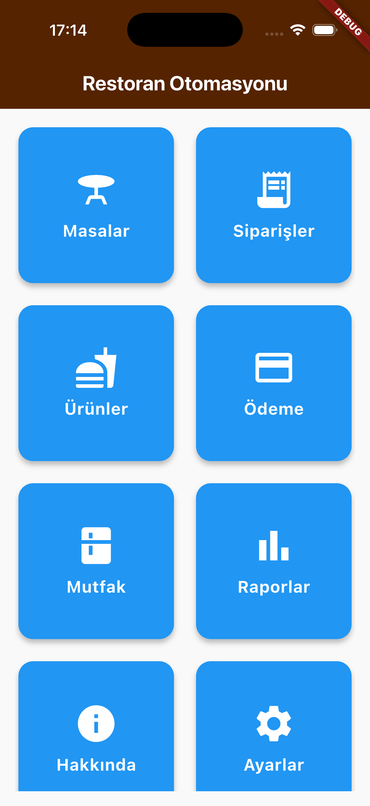
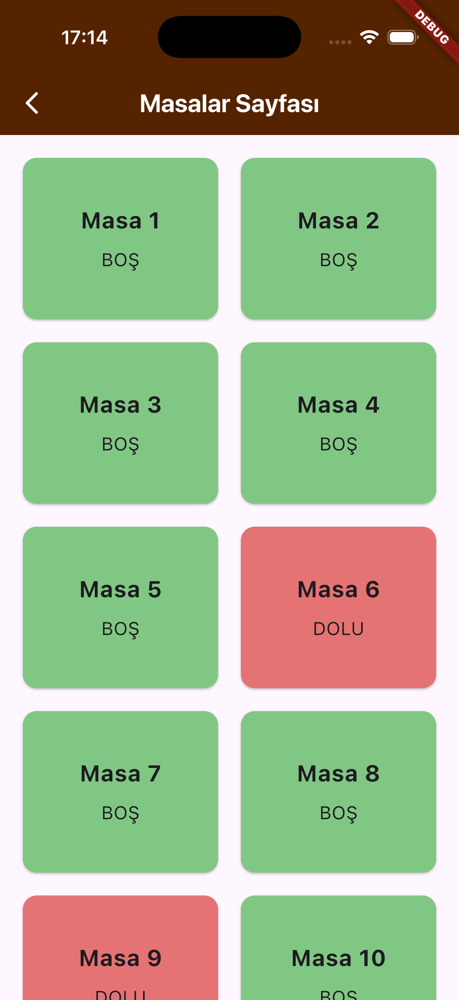
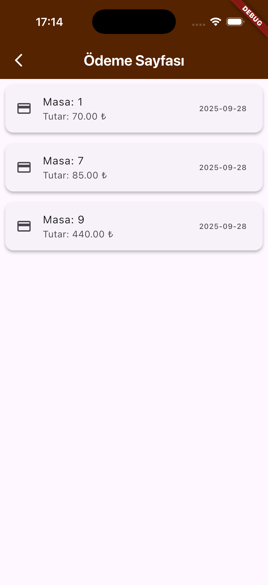
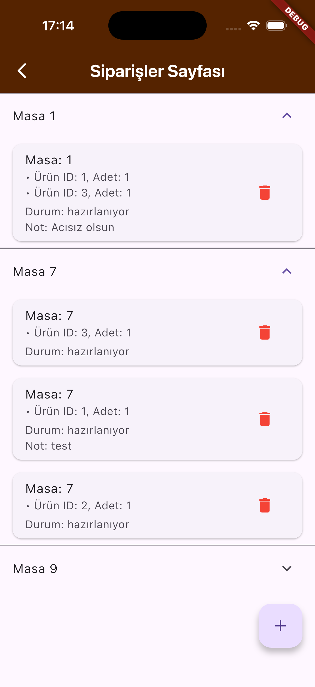
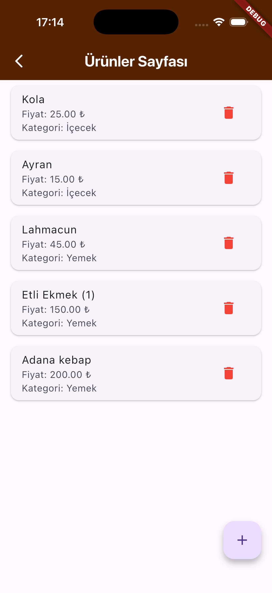

# Restoran Otomasyonu


[](LICENSE)

Restoran Otomasyonu, bir restoranın günlük iş süreçlerini dijitalleştirmek amacıyla geliştirilmiş Flutter tabanlı bir uygulamadır.
Masa, sipariş, ürün ve ödeme yönetimi modülleriyle **tamamen entegre** bir çözüm sunar.
Backend tarafında **JSON Server** kullanılmıştır.

---

## 🌟 Özellikler

* 🍽️ **Masalar** → Masaları listeleme, görüntüleme
* 📦 **Ürünler** → Ürünleri ekleme, listeleme
* 🧾 **Siparişler** → Yeni sipariş ekleme, siparişleri takip etme
* 💳 **Ödemeler** → Sipariş ödemelerini görüntüleme ve yönetme
* 🔪 **Mutfak** → Hazırlanan siparişleri görüntüleme *(geliştirme aşamasında)*
* 📊 **Raporlar** → Günlük/aylık satış ve gelir raporları *(planlandı)*
* ℹ️ **Hakkında** → Uygulama ve geliştirici bilgileri *(planlandı)*
* ⚙️ **Ayarlar** → Kullanıcı ve sistem ayarları *(planlandı)*
* 🛠 **MVVM Mimari** → Temiz ve sürdürülebilir kod yapısı

---

## 🧰 Teknik Altyapı

* **Framework**: Flutter
* **Dil**: Dart
* **Backend**: JSON Server (db.json)
* **Mimari**: MVVM (Model-View-ViewModel)
* **Durum Yönetimi**: Provider
* **Servisler**: REST API

---

## 📂 Proje Yapısı

```plaintext
lib/
├── core/          # Temel servisler, utils ve base sınıflar
├── data/          # Modeller, repository ve API datasources
├── features/      # Modüller (Masalar, Siparişler, Ürünler, Ödemeler, vb.)
└── main.dart      # Giriş noktası
```

---

## 🚀 Kurulum ve Çalıştırma

### Gereksinimler

* Flutter SDK (3.0 veya üstü)
* Dart SDK (2.17 veya üstü)
* Node.js (JSON Server için)

### Adımlar

1. **Depoyu klonlayın**

   ```bash
   git clone https://github.com/wetadeveloper/restoran_otomasyonu.git
   cd restoran_otomasyonu
   ```

2. **Backend’i hazırlayın**
   Bu repo güvenlik nedeniyle `db.json` dosyasını içermez.
   Çalıştırmak için `backend` klasöründe kendi `db.json` dosyanızı oluşturun veya örnek dosyayı kopyalayın:

   ```bash
   cd backend
   cp db.example.json db.json
   ```

   JSON Server’ı başlatın:

   ```bash
   npx json-server --watch db.json --port 3000
   ```

   Endpointler:

   * [http://localhost:3000/urunler](http://localhost:3000/urunler)
   * [http://localhost:3000/masalar](http://localhost:3000/masalar)
   * [http://localhost:3000/siparisler](http://localhost:3000/siparisler)
   * [http://localhost:3000/odemeler](http://localhost:3000/odemeler)

3. **Flutter bağımlılıklarını yükleyin**

   ```bash
   flutter pub get
   ```

4. **Uygulamayı çalıştırın**

   ```bash
   flutter run
   ```

---

## 🔒 Backend (db.json) Hakkında

* `backend/db.json` **repoya yüklenmez** — `.gitignore` içine alınmıştır.
* Gerçek müşteri/iş verilerini burada tutmayın.
* Projeyi çalıştırmak isteyenler için `backend/db.example.json` sağlanmıştır.

### Örnek `db.example.json`

```json
{
  "urunler": [
    { "id": 1, "isim": "Ayran", "fiyat": 15, "kategori": "İçecek" },
    { "id": 2, "isim": "Lahmacun", "fiyat": 40, "kategori": "Ana Yemek" }
  ],
  "masalar": [
    { "id": 1, "isim": "Masa 1", "kapasite": 4, "durum": "bos" },
    { "id": 2, "isim": "Masa 2", "kapasite": 2, "durum": "dolu" }
  ],
  "siparisler": [
    { "id": 1, "masaId": 2, "urunler": [ { "urunId": 2, "adet": 1 } ], "tutar": 40, "durum": "hazirlaniyor" }
  ],
  "odemeler": [
    { "id": 1, "siparisId": 1, "tutar": 40, "tip": "nakit", "tarih": "2025-09-01T12:30:00Z" }
  ]
}
```

---

## 📊 Yol Haritası

| Özellik           | Durum                   |
| ----------------- | ----------------------- |
| Masa yönetimi     | ✅ Tamamlandı            |
| Ürün yönetimi     | ✅ Tamamlandı            |
| Sipariş yönetimi  | ✅ Tamamlandı            |
| Ödeme yönetimi    | ✅ Tamamlandı            |
| Mutfak sayfası    | ⏳ Geliştirme aşamasında |
| Raporlama modülü  | ⏳ Planlandı             |
| Hakkında sayfası  | ⏳ Planlandı             |
| Ayarlar sayfası   | ⏳ Planlandı             |
| Çoklu dil desteği | ⏳ Planlandı             |
| Bildirim sistemi  | ⏳ Planlandı             |

---

## 📸 Ekran Görüntüleri

<table>
  <tr>
    <td></td>
    <td></td>
    <td></td>
    <td></td>
    <td></td>
  </tr>
</table>

---

## 📄 Lisans

Bu proje MIT lisansı ile dağıtılmaktadır. Daha fazla bilgi için `LICENSE` dosyasına göz atın.

---

## 📬 İletişim

**Furkan Pala** – Flutter Developer
[](https://www.linkedin.com/in/furkan-pala-9086191b0/)
[](https://github.com/wetadeveloper)
